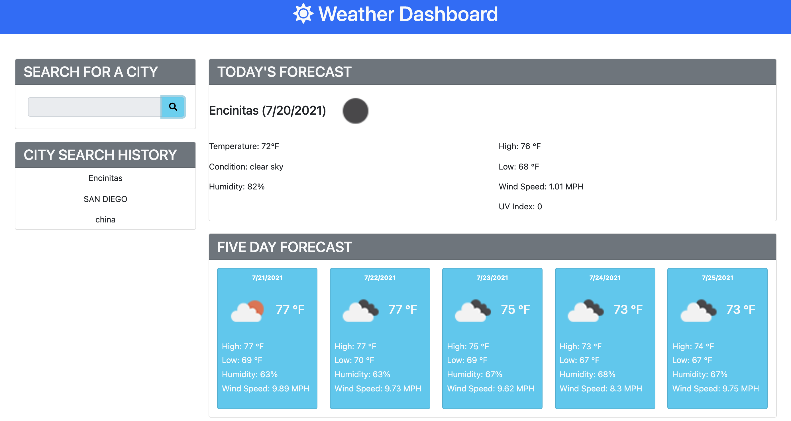

As a traveler, do you want to see the weather outlook for multiple cities? That way you can plan your trip accordingly.

Then look no further and try out weatherDashboard. 

### This app features: 

- Search for a city and present you with current and future conditions for that city and that city is added to the search history

- Let you view current weather conditions for that city and present you with the city name, the date, an icon representation of weather conditions, the temperature, the humidity, the wind speed, and the UV index.

- View the UV index and indicates whether the conditions are favorable, moderate, or severe.

- View future weather conditions for a city and you are presented with a 5-day forecast that displays the date, an icon representation of weather conditions, the temperature, the wind speed, and the humidity.

- You can click on a city in the search history and you are presented with current and future conditions for that city

### Take a look at the app:

### Demo app here:
https://xboboyx.github.io/weatherDashboard/

